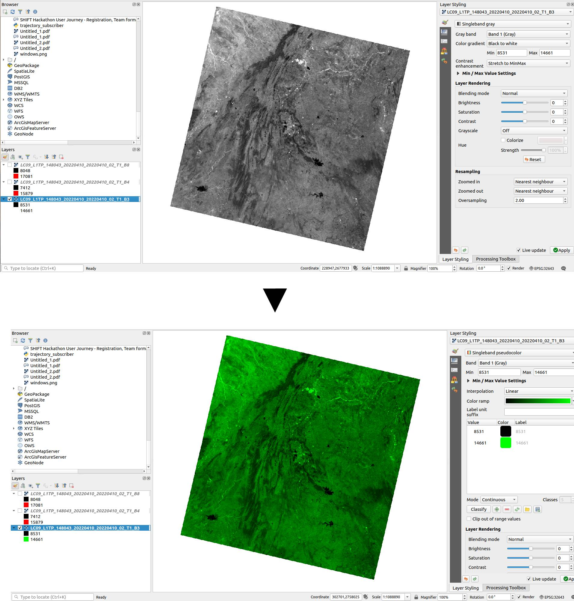
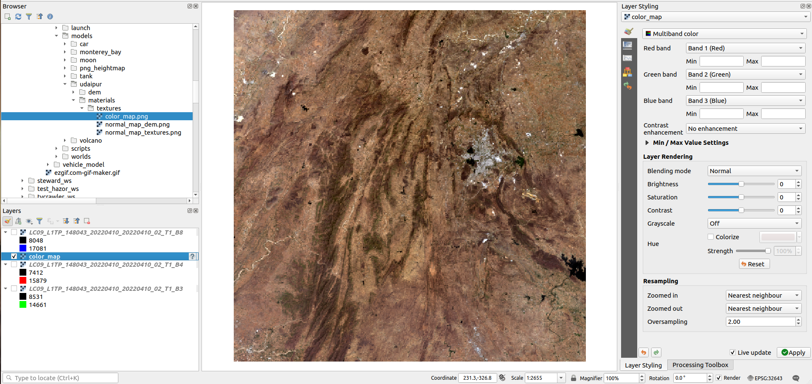

Generating Real-World Terrain Models
====================================

[This](https://www.youtube.com/watch?v=-ubDqXZtdJE) tutorial was referred to for this whole process. Watching it is highly recommended at least till the 30:00 minute mark.
<figure>
<iframe width="560" height="315" src="https://www.youtube.com/embed/-ubDqXZtdJE?start=1505" title="YouTube video player" frameborder="0" allow="accelerometer; autoplay; clipboard-write; encrypted-media; gyroscope; picture-in-picture" allowfullscreen></iframe>
</figure>

  

As discussed above, we need mainly 2 kinds of maps for the terrain models, heightmap & texture maps. For real-world terrains, these maps can be found in satellite data.

  

Satellite Data
--------------

Satellites like the [SRTM (Shuttle Radar Topography Mission)](https://www.usgs.gov/centers/eros/science/usgs-eros-archive-digital-elevation-shuttle-radar-topography-mission-srtm-1) collect digital elevation data from all over the world with high accuracy. This satellite's images can be used as a grayscale heightmap of the region of interest.

Similarly, the [Landsat](https://www.nasa.gov/mission_pages/landsat/overview/index.html) satellite's data can be used to create the texture map. These satellites take images of earth in various wavelengths of light including infrared, visible (red, blue, green), etc. We can use the satellite images belonging to the red, blue, and green bands to create the texture map.

  

[Earth Explorer](https://earthexplorer.usgs.gov/) can be used to download the data of the above-mentioned satellites in the form of images for any region of the world.

  

Post Processing with QGIS
-------------------------

[QGIS](https://www.qgis.org/en/site/forusers/download.html) will be required to post-process the satellite data. Since Landsat provides different grayscale images for each band, we need to convert the color of those images to the equivalent value of the respective band color. Below is an example where green color has been applied to an image from Landsat belonging to the 'green' band.

  

  

Once this is done for the other visual bands as well (red and blue), we can overlay the resultant images on top of each other by setting the `Blending Mode` to `overlay` in `Layer Styling` toolbar. The final resultant image should then have the true colors of the terrain (shown below) and can be used as the color/texture map.

  

  

The map shown above is for a region near Udaipur, India. The white color in the color map is due to some cloud cover in the satellite's field of vision.

  
